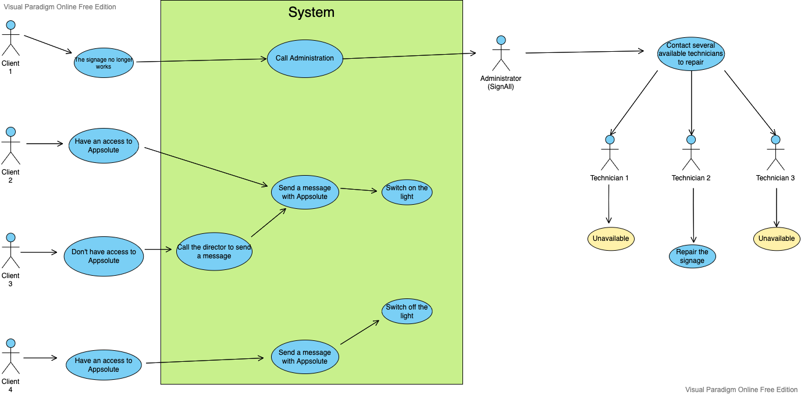

# Functional Specifications

## Stakeolders

| Person/Organization | Role              |
| ------------------- | ----------------- |
| SignAll             | Customers         |
| Tanguy HERRMANN     | Tech Consultant   |
| Théo TROUVE         | Project Manager   |
| Alexandre BOBIS     | Program Manager   |
| Romain NICOLAON     | Tech Leader       |
| Nicolas MIDA        | Software Engineer |
| Audrey TELLIEZ      | Quality Assurance |

---

Table of contents
<blockquote>

- [Functional Specifications](#functional-specifications)
  - [Stakeolders](#stakeolders)
    - [1. Overview](#1-overview)
    - [2. Personas](#2-personas)
      - [2.1. Scenarios](#21-scenarios)
      - [2.2. Use case](#22-use-case)
    - [3. Project Target](#3-project-target)
    - [4. Requirement Specifications](#4-requirement-specifications)
      - [4.1. Device Overview](#41-device-overview)
    - [5. Non goals](#5-non-goals)
    - [6. Development Environement and Requirements](#6-development-environement-and-requirements)
    - [7. Glosary](#7-glosary)

---

### 1. Overview

The goal of the project is to provide to SignAll[^1] a new product for them, that will make their signage smart by being connected. The name of this project is Appsolu.
Nowadays, their existing products are not connected therefore users must be on-site to know if the signage is on, functional, or out of order. Also, users cannot switch the signage on/off remotely.

### 2. Personas

#### 2.1. Scenarios

**Scenario 1: Leïla** works at the McDonald's near her home as a cook. With her teammates, they are ready to open, but they are 15 minutes early and customers are waiting for the opening. Then, they want to open the fast-food restaurant but they don't have any remote to switch on the signage. They try to contact their director, and the director, with Appsolute can activate the signage remotely.

**Scénario 2: Marc** works in an office as a simple employee. The weather is sunny and the signage is on. He wants to switch off lights or reduce the lighting. Thanks to Appsolute, Marc, with his phone, will be able to send a message to reduce or switch off the light. Thanks to this, he was able to carry out an ecological act and thus reduce unnecessary consumption.

**Scénario 3: Philippe** is the manager of a bar, but tonight, the bar is empty, then he wants to switch off the signage. He can do it with Appsolute, and thus save money.

**Scénario 4: Renan** works in the same office than Marc. Marc is eating in a restaurant with other colleagues and Renan is alone in the office. Suddenly, the sign goes out because there is no more battery. Wit Appsolute, Renan will be able to send a message to an admin of SignAll, to ask him/her to change the battery. The admin will call several available technicians. A technician is finally available and will change the battery in few hours. Renan will be able to know when the battery will be changed thanks to Appsolute.

#### 2.2. Use case

### 3. Project Target

For this product, we want to receive a message to see remotely the signage status in real time.
The main features of the project are:

- The follow-up of the signage such as knowing if the signage is on or off, if there is a breakdown or overheating of the product.
- A remote control of the signage like switching on/off, using a dimmable light bulb (dim).
- A consumption reduction and compliance with environmental laws like switching off at given time, adjust intensity based on ambient lighting.

We want to add another features like:

- Statistics about lights and their overheating.
- Send a message to an employee or every employees to inform them about the status of lights and prepare an intervention to fix an issue if there is one.

### 4. Requirement Specifications

#### 4.1. Device Overview

As written in the project target, the application should be able to provide many informations like if the signage is on, functional, or out of order and we will need to be able to switch the signage on/off remotely.

The device will have a power switch control board, LEDs[^2], ambient light sensor, temperature sensor, inductive current sensor, current sensor

### 5. Non goals

Here are some ideas that weren't created:

- Render the project as an application.

### 6. Development Environement and Requirements

- Go[^3]
  - TinyGo[^4]
- MacOSx/Windows on development
- Arduino[^5] on production environment

### 7. Glosary

[^1]: SignAll is a French company that has been manufacturing large luminous signage since 1962. They supply a large number of customers such as McDonald’s, Burger King, La Poste, Orange, AXA, Crédit Agricole, Total, etc. to name a few.

[^2]: LED means Light-Emitting Diode. It is a semiconductor light source that emits light when current flows through it.

[^3]: Go is a compiled and concurrent programming language inspired by other languages (C and Pascal). This language was developed by Google.

[^4]: TinyGo brings the Go programming language to embedded systems and to the modern web by creating a new compiler. You can compile and run TinyGo programs on a wide variety of platforms, including microcontrollers, web browsers, and servers.

[^5]: Arduino is an open-source hardware and software company, project, and user community that designs and manufactures single-board microcontrollers and microcontroller kits for building digital devices.
