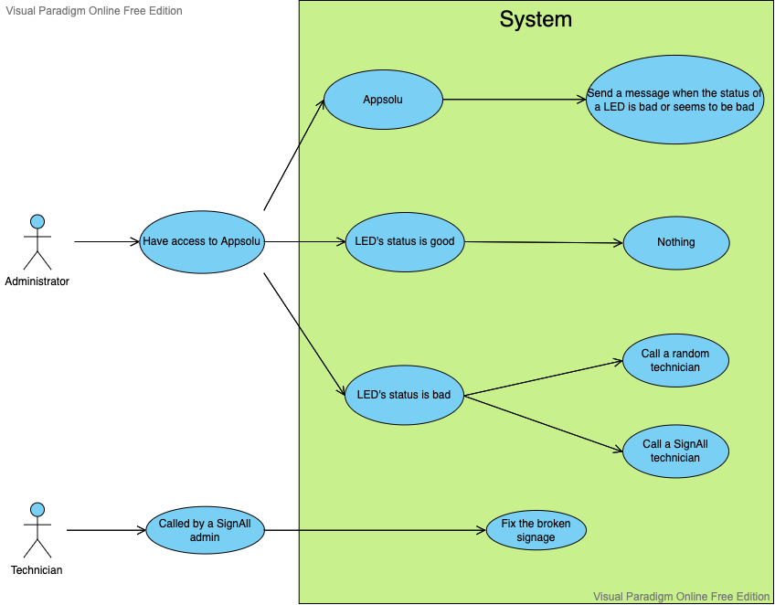

# Functional Specifications

## Stakeolders

| Person/Organization | Role                            |
| :-----------------: | :-----------------------------: |
| SignAll             | Customers                       |
| Tanguy HERRMANN     | Tech Consultant                 |
| Théo TROUVE         | Tech Leader & Project Manager   |
| Alexandre BOBIS     | Tech Leader & Program Manager   |
| Nicolas MIDA        | Tech Leader & Software Engineer |
| Audrey TELLIEZ      | Tech Leader & Quality Assurance |

---

Table of contents
<blockquote>

- [Functional Specifications](#functional-specifications)
  - [Stakeolders](#stakeolders)
  - [1. Overview](#1-overview)
  - [2. Personas](#2-personas)
    - [2.1. Scenarios](#21-scenarios)
    - [2.2. Use case](#22-use-case)
  - [3. Project Target](#3-project-target)
  - [4. Requirement Specifications](#4-requirement-specifications)
    - [4.1. Device Overview](#41-device-overview)
  - [5. Non goals](#5-non-goals)
  - [6. Development Environement and Requirements](#6-development-environement-and-requirements)
  - [7. Glosary](#7-glosary)

---

## 1. Overview

The goal of the project is to provide to SignAll[^1] a new product for them, that will make their signage smart by being connected. The name of this project is Appsolu.
Nowadays, their existing products are not connected therefore users must be on-site to know if the signage is on, functional, or out of order.
One of the other goal of this product is not only to provide a solution for the new signage but also to provide a solution for the existing signage.

## 2. Personas

### 2.1. Scenarios

**Scenario 1: Leïla** works at the McDonald's near her home as a cook. When she arrives, a technician is here to replace a LED, but the signage was working before. The technician explain that a LED of the signage was about to expire and that it had to be changed. Thanks to Appsolu, the intervention went smoothly and without loss of time.

**Scenario 3: Jean** is an employee of SignAll. He is in charge of the maintenance of the signage. This afternoon, he received a message from Appsolu to tell him about the bad status of a LED. Thanks to the app, he can organise quickly the intervention of a technician.

**Scenario 3: Philippe** is an another employee of SignAll. He is in charge of the maintenance of the signage too. With Appsolu, he can see the status of the signage, and if there is a problem, he can send a message to a random technician or a SignAll technician to ask him to come and fix the problem.

### 2.2. Use case

## 3. Project Target

For this product, we want to receive a message to see remotely the signage status in real time.
The main features of the project are:

- The follow-up of the signage such as knowing if the signage is on, off or if a LED is off and then, our product will disable the whole signage.
- Using a dimmable light bulb (dim).
- A consumption reduction and compliance with environmental laws like switching off at given time, adjust intensity based on ambient lighting.
- Send a message to an employee (administrator) to inform them about the status of lights and prepare an intervention to fix an issue if there is one.

We want to add another features like:

- Statistics about lights.

Our real project target is SignAll, but our indirect project targets are SignAll customers. Our product is primarily intended for them.

## 4. Requirement Specifications

### 4.1. Device Overview

As written in the project target, the application should be able to provide many informations like if the signage is on, functional, or out of order and we will need to be able to switch the signage off when there is an issue on a signage and then disable the whole signage.

The device will have a power switch control board, LEDs[^2], ambient light sensor, temperature sensor, inductive current sensor, current sensor

## 5. Non goals

Here are some ideas that weren't created:

- Render the project as an application.
- Give some statistics about the signage.

## 6. Development Environement and Requirements

- Go[^3]
  - TinyGo[^4]
- MacOSx/Windows on development
- Arduino[^5] on production environment
- LoRa-E5[^6] Dev Board (Development Kit)

## 7. Glosary

[^1]: [SignAll](https://signall.com/) is a French company that has been manufacturing large luminous signage since 1962. They supply a large number of customers such as Burger King, La Poste, Orange, AXA, Crédit Agricole, Total, etc. to name a few.

[^2]: LED means Light-Emitting Diode. It is a semiconductor light source that emits light when current flows through it.

[^3]: [Go](https://en.wikipedia.org/wiki/Go_(programming_language)) is a compiled and concurrent programming language inspired by other languages (C and Pascal). This language was developed by Google.

[^4]: TinyGo brings the Go programming language to embedded systems and to the modern web by creating a new compiler. You can compile and run TinyGo programs on a wide variety of platforms, including microcontrollers, web browsers, and servers.

[^5]: [Arduino](https://en.wikipedia.org/wiki/Arduino) is an open-source hardware and software company, project, and user community that designs and manufactures single-board microcontrollers and microcontroller kits for building digital devices.

[^6]: LoRa-E5 Dev Board is a compact board for the evaluation of the [Seeed Studio](https://wiki.seeedstudio.com/) [LoRa-E5 Wio-E5 STM32WLE5JC module](https://wiki.seeedstudio.com/LoRa-E5_STM32WLE5JC_Module/).
